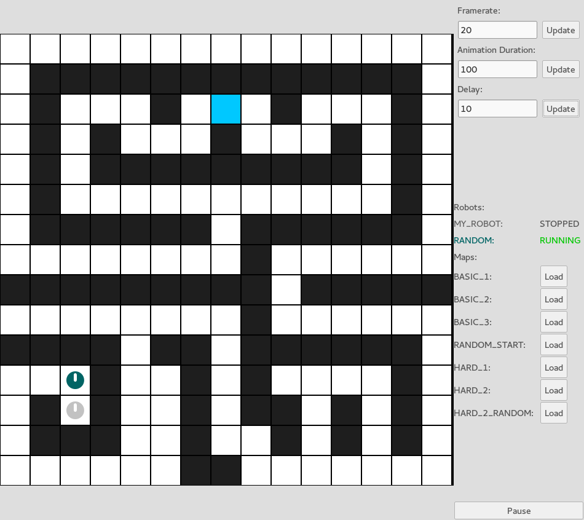

## Introduction

In this lesson, to get an introduction to Java, you will be programming a
virtual robot so that it can navigate its way around a maze and find the
finishing (blue) tile.

  
Task

  

    Create a new folder where we will store everything for the game. Call it
    something like <code>robot_project</code>.
  

### Getting the Files

Your teacher should be able to give you individual instructions on how to get
the files needed for this lesson.

After obtaining the files needed, have a look in the folder, there may be a
number of files and folders, but two are particularly important:

* `src` - This folder contains all of our java source code.
* `make_and_run_gui` - This file is what you canuse to compile our java code
  and run our program if you are not using eclipse.

  
Run Your Code

  

    

      To start off, try running the program to make sure it's working correctly.
    

    

      The way in which you run your program depends on how you have opened the
      files.
    

    <ul>
      <li>
        

          <strong>If Using Eclipse:</strong> Open the folder
          <code>com.samlanning.robot_simulator.simulator</code>, right click
          the file <code>GUISimulator.java</code>, go to <code>Run As</code>
          and then select <code>Java Application</code>.
        

        

          <strong>Hint:</strong> from this point onwards, you can just press
          the green play button at the top of the screen.
        

      </li>
      <li>
        <strong> If NOT Using Eclipse</strong>. Open a terminal inside the
        folder where these files are, and to compile and run the program, you
        need to type the command: <code>./make_and_run_gui</code> from inside
        the terminal. <em>Make sure that your terminal is in the same directory
        as these new files.</em>
      </li>
    </ul>
  

## Understanding The Simulator

To begin with there will not be any maps loaded into the simulator, so the
first thing you need to do is load a map. After a map is loaded, you can start
the robots navigating their way around it by hitting the **Play** button in the
bottom right hand corner.

  
Task

  

    Load each of the different maps, and hit `Play` each time to see how the
    existing bots navigate their way around the map.
  

In the top right hand corner are numbers which control the speed of the
simulator. **Delay** is how much time the robots are paused for after
performing an action (in milliseconds) and **Animation Duration** is how much
time the animations last for (also in milliseconts).

  
Task

  

    Have a go changing these values and see how they affect the simulator.
  

On the right you will also see a list of robots that are currently on the map,
and what their current statuses are.

## Managing Your Robots

Open up the folder `src/com/samlanning/robot_simulator/robots/`. You should see
three files in there:

* `CustomRobot.java` - This is currently a robot that does nothing, you will later
  be modifying this file to make the robot do stuff.
* `RandomRobot.java` - This is a type robot that moves around the map randomly.
* `RobotsEnum.java` - This file contains a list of all the robots that we want
  to currently have on the screen, and what their individual colours are.

Open up the file `RobotsEnum.java`, you should have something that looks like
this:

    package com.samlanning.robot_simulator.robots;

    import java.awt.Color;

    import com.samlanning.robot_simulator.iface.Robot;

    /**
     * An enum of all robots that you want to make available.
     */
    public enum RobotsEnum {

        MY_ROBOT(new CustomRobot(), new Color(100, 100, 100)),
        RANDOM(new RandomRobot(), new Color(0, 100, 100)),
        ;

        public final Robot robot;
        public final Color color;

        private RobotsEnum(Robot robot, Color color){
            this.robot = robot;
            this.color = color;
        }
    }

The important bits are the two lines directly under `public enum RobotsEnum {`.
These two lines define the two robots that we have on the screen at the moment,
one is a `CustomRobot`, and the other is a `RandomRobot`, named `MY_ROBOT` and
`RANDOM` respectively, and with custom colours.

  
Task

  

    

      Lets modify this file to add two more random robots with different
      colours to our simulation.
    

    

      <strong>Under the two existing robots, but above the semicolon</strong>,
      write these two lines:
    

    <pre><code>    RANDOM_2(new RandomRobot(), new Color(100, 0, 100)),
    RANDOM_3(new RandomRobot(), new Color(100, 100, 0)),</code></pre>
  

  
Run Your Code

  

    Run the program to see what effect this has had to the simulation.
  

## Creating Your Own Map

Open up the folder `src/com/samlanning/robot_simulator/maps/`. Like with the
`robots` folder, this folder contains all of the information about the
different maps that are available to the simulator. The file `MapsEnum.java`
contains a list of all the maps that we want to use, along with names for them.

This file should look like this:

    package com.samlanning.robot_simulator.maps;

    import com.samlanning.robot_simulator.iface.RobotMap;

    public enum MapsEnum {

        BASIC_1(new BasicMap1()),
        BASIC_2(new BasicMap2()),
        BASIC_3(new BasicMap3()),
        RANDOM_START(new RandomStartMap(new BasicMap3())),
        HARD_1(new HardMap1()),
        HARD_2(new HardMap2()),
        HARD_2_RANDOM(new RandomStartMap(new HardMap2())),
        ;

        public final RobotMap map;

        private MapsEnum(RobotMap map){
            this.map = map;
        }
    }

  
Task

  

    

      Lets create a new map that we can use in the simulation.
    

    

      Create a new file called <code>BasicMap4.java</code> in the
      <code>maps</code> directory, and give it the following content:
    

    <pre><code>package com.samlanning.robot_simulator.maps;

import com.samlanning.robot_simulator.iface.MapBlock;
import com.samlanning.robot_simulator.iface.RobotMap;
import com.samlanning.robot_simulator.simulator.executor.Direction;

public class BasicMap4 extends RobotMap {
    
    public BasicMap4(){
        MapBlock[][] map = new MapBlock[][]{
            {MapBlock.EMPTY, MapBlock.EMPTY, },
            {MapBlock.EMPTY, MapBlock.EMPTY, },
        };
        
        this.setMap(map, 0, 0, Direction.UP);
    }
    
}
</code></pre>
    

      This is a new map file that has 4 tiles (it is 2 tiles wide and 2 high).
      Lets add this new map to <code>MapsEnum</code>.
    

    

      In the <code>MapsEnum.java</code> file, <strong>after the line
      <code>BASIC_3(new BasicMap3()),</code></strong> add this line:
    

    <pre><code>    BASIC_4(new BasicMap4()),</code></pre>
  

  
Run Your Code

  

    Run the program to check that your new map has appeared in the list on the
    right and that you can load it correctly.
  

  
Task

  

    

      Now modify this new map that you have created, by changing the lines
      under the line <code>MapBlock[][] map = new MapBlock[][]{</code> to make
      the map bigger than 2 x 2, and add some wall and finish objects, like in
      the maps <code>BasicMap1</code> and <code>BasicMap2</code>.
    

    

      <strong>Hint</strong>: Each line should be a row of tiles in the map, and
      every row needs to have the same number of tiles. You have a choice of
      <code>MapBlock.Wall</code>, <code>MapBlock.FINISH</code> and
      <code>MapBlock.EMPTY</code>.
    

  

  
Run Your Code

  

    Run the program to check that your new map works after your changes, and
    appears how you intended when you load it.
  

## Your First Robot

Back in the `robots` folder, open the file `CustomRobot.java`. You should see
something like this:

    package com.samlanning.robot_simulator.robots;

    import com.samlanning.robot_simulator.iface.Robot;
    import com.samlanning.robot_simulator.iface.RobotControl;

    public class CustomRobot implements Robot {

        @Override
        public void run(final RobotControl control) {

        }

    }

This file contains the code for a robot that currently does nothing, we will
modify this robot so that it can complete some of the maps.

The main component inside this file is the **class** `CustomRobot`, it begins with
this line:

    public class CustomRobot implements Robot {

This class defines what a `CustomRobot` is and how it should behave, everything
between this line and the last line (`}`) is inside the class.
At the moment there is only a single thing inside of this class, the **method**
`run`:

        @Override
        public void run(final RobotControl control) {

        }

This method is like a **function**, and is called by our simulator to control
the robot when a simulation starts. There is currently no code inside of this
function (between the curly brackets `{` and `}`), so this robot will do
nothing, and **stop** immidiately.

The file `RobotsEnum.java` contains the code which uses this class, it creates
a robot called `MY_ROBOT`, which is a `CustomRobot`.

If you run the program, you can see that this robot is marked as `STOPPED`
as soon as the simulation is started because it doesn't do anything inside this
method.

Lets make this robot do something!

  
Task

  

    

      Inside the <code>run</code> method, write these 4 lines of code:
    

    <pre><code>        control.moveForward();
        control.moveForward();
        control.turnLeft();
        control.turnRight();</code></pre>
  

`control` is a variable that is accessible from inside the method, it allows
the robot to move forwards, or turn left / right in the simulator, and allows
it to detect what the tile infront of it is.

In this example, the robot requests to move forward twice, and then move left
and right.

  
Run Your Code

  

    Run the program to see how the robot behaves in the maps
    <code>BASIC_1</code> and <code>BASIC_2</code>. What happens to the robot in
    the map <code>BASIC_3</code>?
  

  
Task

  

    Add one extra call to <code>control.moveForward();</code> at the end of the
    code you have just written, and run it again to see what happens in the
    maps <code>BASIC_1</code> and <code>BASIC_2</code>.
  

## Complete The First Map

Now that you have learned the first building blocks needed to move your robot
around the screen, you have got enough tools to help you make a robot that can
navigate its way around one of the maps.

  
Task

  

    

      Modify your current robot (<code>CustomRobot</code>) so that it can
      navigate its way to the finish tile (the blue one) in the map
      <code>BASIC_1</code>.
    

    

      <strong>Hint:</strong> you only need to use these three statements, the
      correct number of times and in the right order:
    

    <ul>
      <li><code>control.moveForward();</code></li>
      <li><code>control.turnLeft();</code></li>
      <li><code>control.turnRight();</code></li>
    </ul>
  

  
Run Your Code

  

    Run your code to make sure that your robot can finish the first map.
  

## A Robot With A Graphical Remote Control

We are now going to make a robot that you can give commands to at each step of
the way so that you can allow it to navigate to the finish manually.

  
Task

  

    

      In the robots folder, create a new class and call it
      <code>RemoteRobot</code>, and paste in the following start code:
    

    <pre><code>package com.samlanning.robot_simulator.robots;

import com.samlanning.robot_simulator.iface.Robot;
import com.samlanning.robot_simulator.iface.RobotControl;

public class RemoteRobot implements Robot {

    @Override
    public void run(RobotControl control) {
        
    }
    
}
</code></pre>
    

      Now open the file <code>RobotsEnum.java</code> and on a new line under
      the line where you create the <code>MY_ROBOT</code> robot, write this:
    

    <pre><code>REMOTE_ROBOT(new RemoteRobot(), new Color(50, 50, 50)),</code></pre>
    

      <strong>Note:</strong> You can get rid of the lines that define the
      random robots now if you like.
    

  

  
Run Your Code

  

    Run your code to make sure that a new robot called
    <code>REMOTE_ROBOT</code> has appeared on the side and in the map.
  

  
Task

  

    

      Under the first line of code in this new file, that starts with
      <code>package</code>, write the following line:
    

    <pre><code>import javax.swing.JOptionPane;</code></pre>
    

      This imports a <strong>class</strong> into our file which we can use in a
      little bit that will allow us to create a popup message that asks the
      user a question.
    

    

      Inside the empty <code>run</code> method, write the following lines of
      code:
    

    <pre><code>        Object[] moves = { "Forwards", "Left", "Right", "Stop" };
            
        int selection = JOptionPane.showOptionDialog(null,
            "Please Pick a Next Move",
            "Next Move",
            JOptionPane.DEFAULT_OPTION,
            JOptionPane.QUESTION_MESSAGE,
            null,
            moves,
            null);</code></pre>
    

      This code firstly creates a new variable called <code>moves</code> that
      is a list of options that we will allow the user to choose from to
      control the robot.
    

    

      Secondly, this code opens up a dialog box asking the user to select an
      option, this code will then wait until the user has selected an option,
      and then the variable <code>selection</code> will become a number between
      <code>0</code> and <code>3</code> that represents the move that the user
      selected.
    

  

  
Run Your Code

  

    Run your code, you should see that when you load a map and start the
    simulation, that a dialog box pops up asking the user for a choice. If you
    select an option, the robot will not do anything and will shut down
    immidiately because we do not actually tell the robot to do anything after
    we ask the user for input.
  

We need to now get the robot to move in the correct way depending on user
input.

  
Task

  

    

      Under the code you have just written, write the following:
    

    <pre><code>            if(selection == 0){
                control.moveForward();
            } else if(selection == 1){
                control.turnLeft();
            } else if(selection == 2){
                control.turnRight();
            } else {
                control.stop();
            }</code></pre>
  

  
Run Your Code

  

    Run your code, after the user chooses an option, you can see that the robot
    will perform the correct action, but it will only ever do one action.
  

At the moment, the robot will never perform more than 1 action, let's get the
robot to continually ask for actions while it is running.

  
Task

  

    

      Above the line where we set the <code>selection</code> variable, write
      this:
    

    <pre><code>while(true) {</code></pre>
    

      And under the last line of code that you added in the previous step, add
      this:
    

    <pre><code>}</code></pre>
    

      What this does is it wraps the code that asks for a user request and
      performs an action in a <strong>while loop</strong> that goes on forever
      (or until the simulator stops the robot, or until the user selects the
      stop action.
    

    

      Now that we have added some extra code around our previous code, the
      indentation is probably all wrong and it would be nice to fix this! If
      you are using eclipse, press the key combination
      <code>Ctrl + Shift + F</code>, and it will automatically format all of
      your code in a nice way to try and make it more readable.
    

    

      The reason it can do this is because, unlike <code>python</code> for
      example, <code>Java</code> is not <strong>whitespace-sensitive</strong>,
      it has other ways of working out what code is &quot;inside&quot; other
      bits of code (the curly braces <code>{</code> and <code>}</code>), so it
      has the freedom to add extra spaces anywhere it likes without changing
      the meaning of the code.
    

  

  
Run Your Code

  

    Run your code, and if all is working, you should be able to control the
    robot to get it to the finish tile.
  

  
Task

  

    

      The final thing that we want to do is move the code in the while loop
      into a separate <strong>method</strong>.
    

    

      Firstly, move the line which creates the variable <code>moves</code> (the
      one that starts with <code>Object[] moves ...</code>),
      <strong>above</strong> the line that says <code>@Override</code>.
    

    

      Next, before the final bracket at the end of the file, write this:
    

    <pre><code>private void doAStep(RobotControl control){
    
}</code></pre>
    

      This is a new method, which takes <code>control</code> as an argument.
    

    

      Next, move all the code from <strong>inside</strong> the
      <strong>while loop</strong> to inside this new method.
    

    

      Finally, inside the old while loop, write this:
    

    <pre><code>doAStep(control);</code></pre>
    

      <strong>Don't forget to re-format your code!</strong> It's good practice
      to do it every time you make a change to your code.
    

  

  
Run Your Code

  

    Run your code, and if all is working, you should be able to control the
    robot to get it to the finish tile.
  

## Detecting what is infront

As well as being able to move the robot around, the variable `control` allows
the robot to check what the tile infront of it is, later we will use this to
create a more intelligent robot that can work its way round many maps, but for
now lets just see how to access this information.

  
Task

  

    

      Above the line
      <code>import com.samlanning.robot_simulator.iface.Robot;</code>, write
      the following:
    

    <pre><code>import com.samlanning.robot_simulator.iface.MapBlock;</code></pre>
    

      This imports the type <code>MapBlock</code> which will allow us to
      inspect the block infront of us.
    

    

      Inside the new <code>doAStep</code> method, right at the start, write
      this:
    

    <pre><code>MapBlock ahead = control.lookAhead();</code></pre>
    

      And below that, where we have the string
      <code>"Please Pick a Next Move"</code>, replace it with this:
    

    <pre><code>"The next block ahead is " + ahead.name()</code></pre>
  

  
Run Your Code

  

    Run your code, and if all is working, when the robot asks the user for the
    next move, it should also say what is currently infront of it.
  

## Making a Robot that works for Many Maps

We are now going to make a robot that is based on a simple idea, try and keep
to the left as much as possible, if there is a wall keep going, and if there is
no wall to the left, turn left and keep going down there. If there is a wall to
your left and infront, turn right, and if there is a wall to the left, the
front and the right, turn all the way around and come back the way you came.

Implementing this robot is made a little bit tricky by the fact that the robot
can only look ahead and not to the side, so it will need to turn to the left
often.

Lets make this robot.

  
Task

  

    

      In the <code>robots</code> folder, create a new class called
      <code>SmartRobot</code>, and write this inside it:
    

    <pre><code>package com.samlanning.robot_simulator.robots;

import com.samlanning.robot_simulator.iface.MapBlock;
import com.samlanning.robot_simulator.iface.Robot;
import com.samlanning.robot_simulator.iface.RobotControl;

public class SmartRobot implements Robot {

    @Override
    public void run(final RobotControl control) {
        
        while(true){
            
            control.turnLeft();
            while(control.lookAhead() == MapBlock.WALL)
                control.turnRight();
            
            control.moveForward();
            
        }
        
    }
    
}
</code></pre>
    

      This robot behaves exactly as described in the paragraphs above, but we
      still need to add it to <code>RobotsEnum</code>.
    

    

      Add this new robot to <code>RobotsEnum</code> like we have done
      previously, call it <code>SMART_ROBOT</code>, and give it any color you
      like.
    

  

  
Run Your Code

  

    Run your code, you should now have a new robot, and it should be able to
    finish the maps <code>BASIC_1</code>, <code>BASIC_2</code>,
    <code>BASIC_3</code> and <code>RANDOM_START</code>.
  

For the map `BASIC_1`, this robot goes the long way round. Lets make a version
that instead keeps to the right and will solve this map quicker.

  
Task

  

    

      Create a new robot called <code>SmartRobot2</code>, and using the same
      starting code as <code>SmartRobot</code>, make it keep to the right
      instead of to the left.
    

    

      Add this robot to <code>RobotsEnum</code> like we have done previously.
    

  

  
Run Your Code

  

    Run your code and make sure your new robot behaves as you would expect.
  

## Challenges (Extension Material - Hard)

When you are comfortable enough with Java, here are some tasks you can do if
you return to this lesson.

* Make a robot that works for the **hard** maps (without hard-coding anything).
* Locate the part of the simulator code that draws the robots on the screen,
  and change the look of the robots to a different shape, and potentially make
  them very detailed.
* Modify `RobotControl` so that a robot is also able to look left and right,
  update the simulator for this to work, and create an up-to-date robot that
  can finish a maze using less moves.
* Modify `RobotControl` so that a robot can also move backwards one space, and
  create a robot that uses this functionality. Make sure that you handle
  **crashes** correctly.
