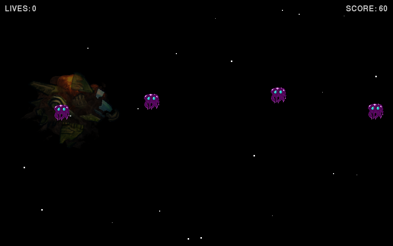

# Teaching Python

Python is an excellent language to introduce programming with. It has a very
small barrier of entry, a "hello world" program is a single line, and you don't
need to introduce the concept of classes and static methods right at the start.

## Lessons

### [Space Shooter](space_shooter/)

**Difficulty:** Medium

Create a 2D Side-Scroller Alien Shooter game using `pygame`.
