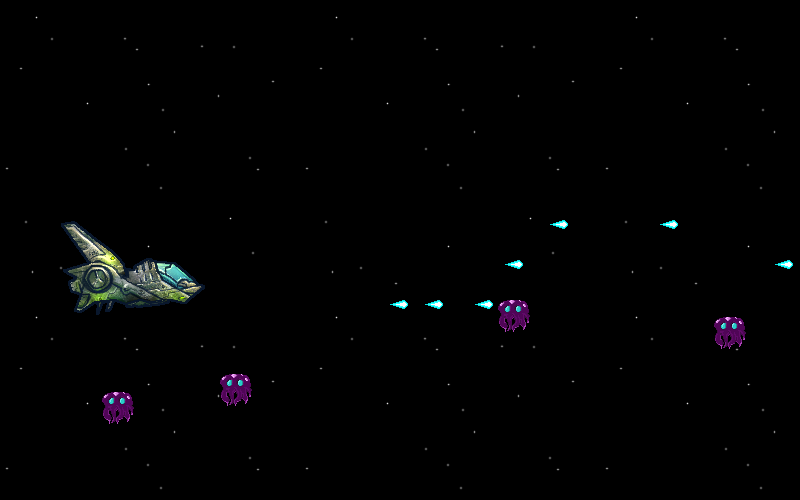

# Space Shooter Game

## Lesson Aims

During the course of this lesson, students should be able to create a
side-scroller alien shooter game, with keyboard controls.

## Prerequisites

For this lesson to work, students need to have a `python 2` programming
environment ready, with [pygame](http://pygame.org/) installed and ready to
import. Raspberry Pis with [Raspbian](http://www.raspbian.org/) come with these
prerequisites satisfied.

This lesson follows the "seperate text-editor & interpreter" model for writing
code, rather than an integrated IDE. So students are expected to have a text
editor and terminal open, and know how to run python on a specific `.py` file.
Particular attention should be paid to which directory they are saving files,
which directory the terminal is in, and **not** using spaces in names.

Which text editor is used is up to the teacher, but at a minimum, something
with syntax highlighting should be used.

## Assumptions

* Running `python` will launch Python 2.X **not** Python 3.X.. If you are
  teaching using arch linux, or something else that uses python 3 by default,
  look out for this. This can usually be circumvented by running the command
  `python2` instead of `python`.

## [View Lesson](lesson/)
