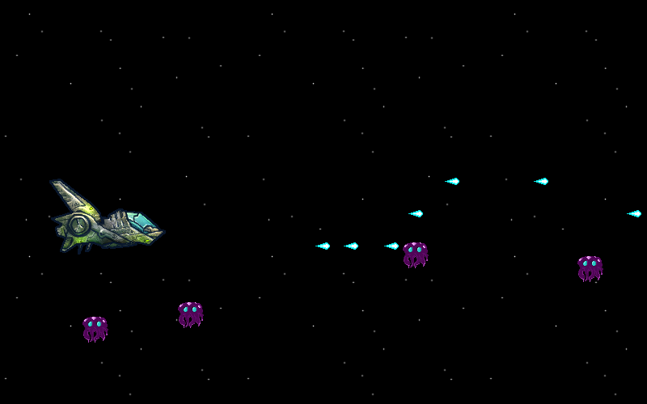

## Introduction

In this lesson, you will be creating a 2D scroller game where the player
controls a space ship, and has to shoot as many aliens as possible before they
run out of lives.

You will be using `python` and `pygame` to create this game.

  
Task

  

    Create a new folder where we will store everything for the game. Call it
    something like <code>space_game</code>.
  

### Download Files

Here are the files that you need to download to use in your game.

* [`alien_1.png`](downloads/alien_1.png)
* [`bullet.png`](downloads/bullet.png)
* [`ship_down.png`](downloads/ship_down.png)
* [`ship_normal.png`](downloads/ship_normal.png)
* [`ship_up.png`](downloads/ship_up.png)
* [`stars_1.png`](downloads/stars_1.png)
* [`stars_2.png`](downloads/stars_2.png)

*Attribution and copyright for these images can be found on the [lesson
details page](../).*

  
Task

  

    Download each of these files into the new folder you just created, but
    don't change their names.
  

## Understanding Screens

Throughout the development of the game, we will be interacting with the
computer screen. Computer screens are made up of something called **pixels**,
a pixel is a very very tiny dot on the screen that can be many different
colours. Pixels of a computer screen are arranged into a rectangular grid, and
they work the exact same way as a television. A typical television will be
`1,920` pixels wide and `1,080` pixels tall, which means that it has
`2,073,600` pixels filling the whole screen.

### How movement on a screen work (frames)

To make it seem like things move on a computer screen or a television, what
happens is that the image changes many times a second, to trick our eyes into
thinking that things are moving. The number of times the picture changes every
second is called the **framerate**.

When we create our game, we will have a game **window**, which will be a
rectangular area, a certain number of pixels wide and high, which we will draw
to. When we want to show something moving in the window, we will re-draw the
entire window, and move the objects slightly, a certain number of times per
second.

## Getting Started

  
Task

  

    Create a new python file called <code>game.py</code> in your python text
    editor, enter the following code, and save the file.
  

    import pygame
    import sys

    pygame.init()

    window = pygame.display.set_mode((800, 500))
    clock = pygame.time.Clock()

    while True:

        for event in pygame.event.get():
            if event.type == pygame.QUIT:
                sys.exit()

        clock.tick(50)

  
Note

  

    Pay very close attention to the amount of space before the code on each
    line. This is called indentation.
  

  
Run Your Code

  

    Try running your code now. You do this by typing <code>python
    game.py</code> from inside your terminal. (Make sure that your terminal is
    in the same folder that all your game files are in).
  

If everything is working, a new black window should have appeared with nothing
inside. This is going to be our game screen, and we will start adding things to
it.

  
Remember

  

    If you have run into a problem, ask your teacher or a helper before
    continuing.
  

## Explaining The Starting Code

Now that we have the starting code for our game, lets go through and see what
each bit does.

    import pygame
    import sys

These first two lines tell python that we want to need to use some extra cod
from outside of our `game.py` file. In particular we want to use `pygame` and
`sys` at the moment. These are called `modules`.

We are going to use the `pygame` module a lot in this project.

    pygame.init()

This line tells `pygame` to make sure that everything is ready for us to use.

    window = pygame.display.set_mode((800, 500))

There are a few important things going on on this line. One of the first things
you should notice is that there is an equals `=` sign. What an equals sign
allows us to to is create variables.

A variable is like a **box** in our program that we can use to store stuff in,
and every variable has a name. If we write this code:

    my_variable = 4

... what we have done is create a new variable, a new box, and given it the
name `my_variable`. We've also put the number `4` inside it.

If we write this code:

    another_variable = 20
    another_variable = 21

... then we have created a variable called `another_variable`, given it the
value `20`, and then changed it straight away by giving it the value `21`.

Let's have a look at the code we've already written again:

    window = pygame.display.set_mode((800, 500))

The part of the code to the right of the equals sign,
`pygame.display.set_mode((800, 500))`, basically tells `pygame` that we want
a window on the computer screen that is `800` pixels wide, and `500` pixels
tall, and this is what it returns. This means that after this line of code is
run, we have a variable called `window` (remember a variable is a box), and
inside that variable is a window that we can manipulate, by drawing things on
it.

The next line is a little bit simpler:

    clock = pygame.time.Clock()

What this does is create a variable called `clock`, and make the value of that
variable a new `Clock`. A `pygame` clock is important, because it allows us to
control the frame rate (remember, the frame rate is how many times the screen
changes per second). You will see how we use the clock very shortly.

The next part of the code is where the magic happens:

    while True:

        for event in pygame.event.get():
            if event.type == pygame.QUIT:
                sys.exit()

        clock.tick(50)

This is what we call our **event loop**. The first line `while True`, means "do
this forever". Every line under this line has some extra space at the start of
it, this is what's called **indentation**. This is important because it tells
python that these lines of code are **inside** the loop, which means every time
the loop runs, it will run all the code that has the correct amount of space at
the start.

We are going to use our event loop at the heart of our game, and we will run
the loop once for each time we want to create the next frame of our window.

Every time we want to create the next frame, we will:

* Check if the user has interacted with the window at all (for example pressed
  an arrow key, or closed the window).
* Update information about the objects on the screen.
* Draw a new frame from scratch.
* Display that frame in our window.

Finally, let's address the last bits of the code.

        for event in pygame.event.get():
            if event.type == pygame.QUIT:
                sys.exit()

We'll skip over an explanation for these three lines of code for now, but they
will be explained later on.

        clock.tick(50)

Now this is a clever bit of code. Because computers are so fast, if we let the
event loop run without any limitation, it would run many many thousands of
times faster than we would like, because the number of times it runs per second
will determine what our framerate is. This means that things moving on the
screen will probably be moving much faster than we would like.

This line of code makes our program pause (basically slows it down), so it only
runs as fast as we want it to. Because we gave it the value `50`, it will make
sure that our loop does not run more than `50` times per second, so that our
frame rate will also not be faster than `50` times per second.

Later on, when we have things moving on screen, you will have the opportunity
to experiment with the frame rate, and see what the effect of it is on your
game.

  
Work in Progress!

  

    

      I have not yet finished writing this lesson. Thank you for your eagerness
      though. This page is being updated constantly.
    

    

      In the mean time, if you are interested in teaching python to students, I
      would recommend <a href="http://projects.codeclub.org.uk/">CodeClub's</a>
      resources.
    

  

