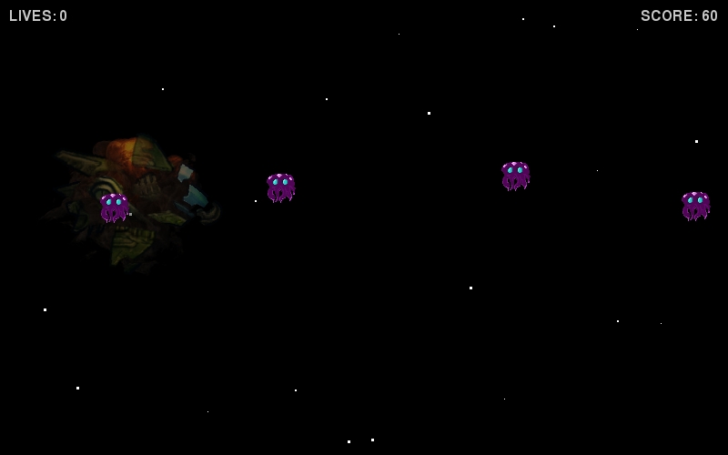
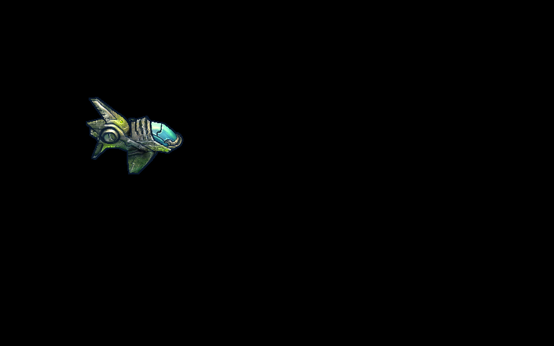

## Introduction

In this lesson, you will be creating a 2D scroller game where the player
controls a space ship, and has to shoot as many aliens as possible before they
run out of lives.

You will be using `python` and `pygame` to create this game.

  
Task

  

    Create a new folder where we will store everything for the game. Call it
    something like <code>space_game</code>.
  

### Download Files

Here are the files that you need to download to use in your game.

* [`alien_1.png`](downloads/alien_1.png)
* [`alien_1_dead.png`](downloads/alien_1_dead.png)
* [`bullet.png`](downloads/bullet.png)
* [`ship_down.png`](downloads/ship_down.png)
* [`ship_normal.png`](downloads/ship_normal.png)
* [`ship_up.png`](downloads/ship_up.png)
* [`ship_destroyed.png`](downloads/ship_destroyed.png)

*Attribution and copyright for these images can be found on the [lesson
details page](../).*

  
Task

  

    Download each of these files into the new folder you just created, but
    don't change their names.
  

## Understanding Screens

Throughout the development of the game, we will be interacting with the
computer screen. Computer screens are made up of something called **pixels**,
a pixel is a very very tiny dot on the screen that can be many different
colours. Pixels of a computer screen are arranged into a rectangular grid, and
they work the exact same way as a television. A typical television will be
`1,920` pixels wide and `1,080` pixels tall, which means that it has
`2,073,600` pixels filling the whole screen.

### How movement on a screen work (frames)

To make it seem like things move on a computer screen or a television, what
happens is that the image changes many times a second, to trick our eyes into
thinking that things are moving. The number of times the picture changes every
second is called the **framerate**.

When we create our game, we will have a game **window**, which will be a
rectangular area, a certain number of pixels wide and high, which we will draw
to. When we want to show something moving in the window, we will re-draw the
entire window, and move the objects slightly, a certain number of times per
second.

## Getting Started

  
Task

  

    Create a new python file called <code>game.py</code> in your python text
    editor, enter the following code, and save the file <strong>in the folder
    you just created</strong>.
  

    import pygame
    import sys

    pygame.init()

    window = pygame.display.set_mode((800, 500))
    clock = pygame.time.Clock()

    while True:

        for event in pygame.event.get():
            if event.type == pygame.QUIT:
                sys.exit()

        clock.tick(50)

  
Note

  

    Pay very close attention to the amount of space before the code on each
    line. This is called indentation.
  

  
Run Your Code

  

    Try running your code now. You do this by typing <code>python
    game.py</code> from inside your terminal. (Make sure that your terminal is
    in the same folder that all your game files are in).
  

If everything is working, a new black window should have appeared with nothing
inside. This is going to be our game screen, and we will start adding things to
it.

  
Remember

  

    If you have run into a problem, ask your teacher or a helper before
    continuing.
  

## Explaining The Starting Code

Now that we have the starting code for our game, lets go through and see what
each bit does.

    import pygame
    import sys

These first two lines tell python that we want to use some extra code from
outside of our `game.py` file. In particular we want to use `pygame` and `sys`
at the moment. These are called `modules`.

We are going to use the `pygame` module a lot in this project.

    pygame.init()

This line tells `pygame` to make sure that everything is ready for us to use.

    window = pygame.display.set_mode((800, 500))

There are a few important things going on on this line. One of the first things
you should notice is that there is an equals `=` sign. What an equals sign
allows us to to is create variables.

A variable is like a **box** in our program that we can use to store stuff in,
and every variable has a name. If we write this code:

    my_variable = 4

... what we have done is create a new variable, a new box, and given it the
name `my_variable`. We've also put the number `4` inside it.

If we write this code:

    another_variable = 20
    another_variable = 21

... then we have created a variable called `another_variable`, given it the
value `20`, and then changed it straight away by giving it the value `21`.

Let's have a look at the code we've already written again:

    window = pygame.display.set_mode((800, 500))

The part of the code to the right of the equals sign,
`pygame.display.set_mode((800, 500))`, basically tells `pygame` that we want
a window on the computer screen that is `800` pixels wide, and `500` pixels
tall, and this is what it returns. This means that after this line of code is
run, we have a variable called `window` (remember a variable is a box), and
inside that variable is a window that we can manipulate, by drawing things on
it.

The next line is a little bit simpler:

    clock = pygame.time.Clock()

What this does is create a variable called `clock`, and make the value of that
variable a new `Clock`. A `pygame` clock is important, because it allows us to
control the frame rate (remember, the frame rate is how many times the screen
changes per second). You will see how we use the clock very shortly.

The next part of the code is where the magic happens:

    while True:

        for event in pygame.event.get():
            if event.type == pygame.QUIT:
                sys.exit()

        clock.tick(50)

This is what we call our **event loop**. The first line `while True`, means "do
this forever". Every line under this line has some extra space at the start of
it, this is what's called **indentation**. This is important because it tells
python that these lines of code are **inside** the loop, which means every time
the loop runs, it will run all the code that has the correct amount of space at
the start.

We are going to use our event loop at the heart of our game, and we will run
the loop once for each time we want to create the next frame of our window.

Every time we want to create the next frame, we will:

* Check if the user has interacted with the window at all (for example pressed
  an arrow key, or closed the window).
* Update information about the objects on the screen.
* Draw a new frame from scratch.
* Display that frame in our window.

Finally, let's address the last bits of the code.

        for event in pygame.event.get():
            if event.type == pygame.QUIT:
                sys.exit()

We'll skip over an explanation for these three lines of code for now, but they
will be explained later on. For now, all you need to know is that it checks if
the user has closed the window, and if the window has been closed we close the
whole program.

        clock.tick(50)

Now this is a clever bit of code. Because computers are so fast, if we let the
event loop run without any limitation, it would run many many thousands of
times faster than we would like, because the number of times it runs per second
will determine what our framerate is. This means that things moving on the
screen will probably be moving much faster than we would like.

One of the first things you should notice about this line is that it starts
with the same name as the variable `clock` that we created earlier, that is
because it is actually using the value stored inside that variable. We created
a `pygame` clock, and saved it in the variable `clock`, and now we have used
it. This line of code makes our program pause (basically slows it down), so it
only runs as fast as we want it to. Because we gave it the value `50`, it will
make sure that our loop does not run more than `50` times per second, so that
our frame rate will also not be faster than `50` times per second.

Later on, when we have things moving on screen, you will have the opportunity
to experiment with the frame rate, and see what the effect of it is on your
game.

  
Task: Experiment!

  

    Change the numbers for the line that tells <code>pygame</code> the width
    and height, and run your code each time you change it. Do this a few times.
    Remember to change the numbers back to what they were before you continue.
  

## Adding a Space Ship

Now let's add our first image to the game.

  
Task:

  

    
Add these lines of code to your program above the while loop:

<pre><code>background = (0, 0, 0)
ship_image = pygame.image.load("ship_normal.png")</code></pre>
    
And add these lines of code above the clock tick, indented by
      <strong>four spaces</strong>.

<pre><code>    window.fill(background)
    window.blit(ship_image, (0, 0))

    pygame.display.flip()</code></pre>
  

Your code should now look like this:

    import pygame
    import sys

    pygame.init()

    window = pygame.display.set_mode((800, 500))
    clock = pygame.time.Clock()

    background = (0, 0, 0)
    ship_image = pygame.image.load("ship_normal.png")

    while True:

        for event in pygame.event.get():
            if event.type == pygame.QUIT:
                sys.exit()

        window.fill(background)
        window.blit(ship_image, (0, 0))

        pygame.display.flip()

        clock.tick(50)

  
Note

  

    Python does not care how many blank lines there are between lines of code,
    but it can make it easier to read and understand what's going on.
  

  
Run Your Code

  

    

    Try running your code now. If everything is working, you should now see
    a black window with a space ship in the top left, like this:
    

    

      
    

  

Lets have a look at what the code that we have added is doing:

    background = (0, 0, 0)
    ship_image = pygame.image.load("ship_normal.png")

The first line is creating a variable called `background`. The value of this
variable is 3 numbers grouped together, into something called a **tuple**. At
the moment, this variable is used in one place, on the line that says
`window.fill(background)`, which we will explain in a bit, and we will explain
what those numbers mean.

The second line is creating a variable called `ship_image`, and loading an
image file (specifically the one stored as `ship_normal.png`), and storing the
image inside that variable.

        window.fill(background)
        window.blit(ship_image, (0, 0))

        pygame.display.flip()

These lines of code are all making changes to what we can see in the window.
And because they are all **indented** by `4` spaces, they are **inside** the
`while` loop (our event loop), which means they are run once every frame.

The first line fills in the whole window with a specific colour, in this case,
the colour stored in the variable `background`, and that is what the **tuple**
is. The tuple `(0, 0, 0)` represents the colour black, but there are over
16 million colours you can choose from!

The way in which we describe a colour to a computer is with what's called `RGB`
(which stands for **R**ed, **G**reen and **B**lue). This is because each pixel
(in most computer screens) is made up of three smaller parts, each of which
emits a different colour light. One part emits **red** light, one part emits
**green** light, and another part emits **blue** light. This allows us to
display a wide range of colours for each pixel on a screen.

The tuple `(0, 0, 0)` means we want `0` red, `0` green and `0` blue, which is
how we get black, by displaying **no light at all!** Each number in a tuple
which describes a colour has to be between `0` and `255`, it can't be higher
than `255`, and it can't be lower than `0`. For example, if we wanted to
display as much red as we can, but no green and blue, the colour would be
`(255, 0, 0)`.

  
Task: Experiment!

  

    

      Change the numbers inside the <strong>tuple</strong> that we set the
      variable <code>background</code> to, and <strong>run your code each
      time</strong>. See what happens if all the numbers are really big, and
      what happens if they are really small.
    

    

      To really experiment, try adding numbers that are <strong>less
      than</strong> <code>0</code> (eg: <code>-10</code>), or numbers that are
      bigger than <code>255</code>. If you do this, you should see that your
      game <strong>CRASHES!</strong>.
    

    

      It might say something like this:
    

<pre><code>Traceback (most recent call last):
  File "game.py", line 19, in &lt;module&gt;
    window.fill(black)
TypeError: invalid color argument</code></pre>
    

      This means there is a <strong>bug</strong> in your program, and python is
      trying to tell you where the bug is so that you can fix it. When you
      write software and games, you will come accross lots of bugs that you
      will need to fix. This is a normal part of learning to program. Even the
      best programmers make mistakes and need to fix bugs they created on a
      daily basis.
    

    

      <strong>REMEMBER:</strong> Don't forget to change the colour back to
      black (or to a colour close to black) before continuing.
    

  

Lets get back to the code now:

        window.fill(background)
        window.blit(ship_image, (0, 0))

        pygame.display.flip()

The second line of code copies the image that we have loaded and stored in the
variable `ship_image`, and places it inside the window. You can see that when
we run the code, the ship is places in the top left hand corner of the screen.
The two numbers in brackets `(0, 0)` is what is telling `pygame` to do this.
This is another **tuple**, and this tuple is used to represent
**co-ordinates**. Specifically, these co-ordinates are the `x` and `y`
positions of where we want the image to be in our window.

* If we **increase** our `x` value, then the image would be more to the
  **right**.
* If we **increase** our `y` value, then the image would be further **down**
  the screen.

When `x` is `0` and `y` is `0`, then we mean the pixel that is furthest to the
**top** and furthest to the **left**.

Here's a diagram to explain:

  

This is a bit different to what you might be used to with drawing graphs at
school, where the **x-axix** is the same, but the **y-axis** goes up instead of
down. Unfortunately this is how `pygame`, and a lot of other computer graphics
work, and you will need to remember this difference.

  
Task: Experiment!

  

    

      Try changing the numbers for the line of code that copies the space ship
      to the window, and <strong>run your code</strong>. For example, changing
      it to <code>(300, 100)</code> results in this:
    

    

      
    

    

      The ship has moved <code>300</code> pixels right, and <code>100</code>
      pixels down. This is because it now has an <code>x</code> value of
      <code>300</code> and a <code>y</code> value of <code>100</code>.
    

    

      If we instead use the co-ordinates <code>(-50, 50)</code>, we get this:
    

    

      
    

    

      You can see it has moved off screen.
    

  

Lets look at the final line of code we added:

        pygame.display.flip()

This line just tells `pygame` that, now that we have made changes to the
window, we would like it to be updated. The reason it doesn't update the window
automatically is because if we are doing a lot of changes, and if it takes a
long time, the user would see lots of un finished frames, when we are still
making changes to the window.

By requiring us to tell it when we have finished changing the window, `pygame`
can make sure that it updates the screen really quickly, all at once, so the
user never sees half-finished frames.

### Going over All the Code

Lets go over the whole program, and see if we can understand how it all works
together.

    import pygame
    import sys

    pygame.init()

    window = pygame.display.set_mode((800, 500))
    clock = pygame.time.Clock()

    background = (0, 0, 0)
    ship_image = pygame.image.load("ship_normal.png")

    while True:

        for event in pygame.event.get():
            if event.type == pygame.QUIT:
                sys.exit()

        window.fill(background)
        window.blit(ship_image, (0, 0))

        pygame.display.flip()

        clock.tick(50)

**What the code does:**

*Try and follow along with the code above so that you can make sure that you
understand what each line is doing.*

* We tell python that we want to use the `pygame` and `sys` modules.
* We tell `pygame` to set up.
* We create a new variable called `window`, and store a window object in there
  that we can manipulate.
* We create a new variable called `clock`, and store a `pygame` clock in there
  so that we can control the **framerate** of the game.
* We create a new variable called `background`, and store a **tuple** in there.
  We are going to use this **tuple** as a colour.
* We create a new variable called `ship_image`, and store the image of the
  space ship in it.
* We start a **loop**, that repeats forever, and will run once for every frame.
  Inside the loop:
  * We check if the user has closed the window, if the window is closed, we
    stop the program.
  * We fill the whole window with the colour stored in the variable
    `background`.
  * We copy the space ship image stored in `ship_image` to the window, at the
    top left of the screen.
  * We tell `pygame` that we have finished making changes to the window, and it
    should update the screen.
  * We make the loop pause for a short period of time so that our frame rate is
    not too high.

## Making the Space Ship Move

We are now going to use keyboard input to move the space ship around the
screen.

  
Task:

  

    
Firstly add these two lines above the loop:

<pre><code>ship_x = 0
ship_y = 0</code></pre>
  

We are going to use these two variables to keep track of the space ship's
position: we will change them when the player presses the right keys, and use
their values to work out where to copy the space ship image to on the window.

  
Task:

  

    

      Underneath the code that checks if the user has closed the window, add
      this code:
    

<pre><code>    pressed_keys = pygame.key.get_pressed()

    if pressed_keys[pygame.K_UP]:
        ship_y = ship_y - 10

    if pressed_keys[pygame.K_DOWN]:
        ship_y = ship_y + 10

    if pressed_keys[pygame.K_LEFT]:
        ship_x = ship_x - 10

    if pressed_keys[pygame.K_RIGHT]:
        ship_x = ship_x + 10</code></pre>
    

      <strong>Note:</strong> make sure you indent it so that it is inside the
      loop!
    

  

This code that you have just added is what will change the position of the
space ship when you press certain keys on the keyboard.

    pressed_keys = pygame.key.get_pressed()

This line creates a variable called `pressed_keys`, which stores information on
which keys are currently being pressed by the player. Every time we run the
loop, we want to check if the user is currently pressing a particular key, and
if they are, then we will act accordingly.

The rest of the code uses things called **if statements**. If statements make
sure that certain parts of the code only run in certain situations.

Lets take a look at the first **if statement**:

    if pressed_keys[pygame.K_UP]:
        ship_y = ship_y - 10

Firstly, it uses the variable `pressed_keys` to check if the the user is
currently pressing the up key. If they are, then it runs the code which is
**indented** underneath it.

The code which is indented changes the value of the variable `ship_y` to
`ship_y - 10`, which means that `ship_y` will have a value of `1`0 less than it
had before: it will have been decreased.

The other 3 if statements work in the same way, **increasing** or
**decreasing** `ship_x` and `ship_y`.

  
Task:

  

    

      And finally, we want to actually use the variables <code>ship_x</code>
      and <code>ship_y</code> in the part of our code that copies the space
      ship image to the window. SO change this line of code:
    

    <pre><code>    window.blit(ship_image, (0, 0))</code></pre>
    

      To this:
    

    <pre><code>    window.blit(ship_image, (ship_x, ship_y))</code></pre>
  

  
Run Your Code

  

    

      Try running your code now. If everything is working, you should be able
      to press the arrow keys on your keyboard to move the space ship in the
      correct direction for each key.
    

    

      You will notice that it is very easy to make the space ship go off the
      edge of the window, this is probably something we want to fix later
      on&hellip;
    

  

  
Task: Experiment!

  

    

      What happens if you press multiple keys at the same time? What about if
      you press <strong>up</strong> and <strong>down</strong> at the same time?
    

  

  
Task: Experiment!

  

    

      Change the amount that we modify <code>ship_x</code> and
      <code>ship_y</code> by from <code>10</code> to something else. What
      happens if you have different numbers for different directions? Don't
      forget to <strong>run your code</strong> to find out!
    

  

  
Task: Experiment!

  

    

      Now that we have movement in our game, try changing the
      <strong>framerate</strong> of our game, and see what effect that has on
      our game.
    

    

      <strong>Remember:</strong> This is the code that looks like
      <code>clock.tick(50)</code>.
    

  

## Stop the Space Ship Going Out the Window

We are going to stop the space ship going out the window by being careful about
what values we give to `ship_x` and `ship_y`.

  
Task:

  

    

      After the code that changes the <code>ship_x</code> and
      <code>ship_y</code> variables, add this:
    

<pre><code>    # Stop ship going out of bounds
    if ship_y < 0:
        ship_y = 0

    if ship_y > window.get_height() - ship_image.get_height():
        ship_y = window.get_height() - ship_image.get_height()

    if ship_x < 0:
        ship_x = 0

    if ship_x > window.get_width() - ship_image.get_width():
        ship_x = window.get_width() - ship_image.get_width()</code></pre>
    

      <strong>Note:</strong> make sure you indent it so that it is inside the
      loop!
    

  

The line beginning with `#` is called a comment. We've put this here to help us
explain what the code does, and we can write anything after the `#` symbol.

## Making the Ship File Bullets

  
Task:

  

    

      Underneath the code that loads the space ship image, write this code to
      load an image of a bullet.
    

    <pre><code>bullet_image = pygame.image.load("bullet.png")</code></pre>
    

      And under this, write the following lines of code.
    

    <pre><code>class Sprite:
    pass

def display_sprite(sprite):
    window.blit(sprite.image, (sprite.x, sprite.y))</code></pre>
    

      This small bit of code will allow us to create &quot;sprite&quot;
      objects, where we will store the image and location of something we want
      to draw on screen. It also allows us to draw the sprites much more
      easily.
    

    

      Under the code that sets the ship's position to (0, 0), write this line
      of code:
    

    <pre><code>bullets = []</code></pre>
    

      This is where we are going to store a list of all the bullet sprites
      (because we can have lots of them at the same time!)
    

    

      Under that, write this:
    

    <pre><code>def fire_bullet():
    bullet = Sprite()
    bullet.x = ship_x + 130
    bullet.y = ship_y + 100
    bullet.image = bullet_image
    bullets.append(bullet)</code></pre>
    

      This is a function which handles creating the bullets for us. We can put
      <code>fire_bullet()</code> anywhere we want to trigger a bullet being
      fired.
    

    

      Under the code that changes the position of the ship, write this:
    

    <pre><code>if pressed_keys[pygame.K_SPACE]:
        fire_bullet()</code></pre>
    

      And under the code that draws the ship on the window, write this:
    

    <pre><code>for bullet in bullets:
        display_sprite(bullet)</code></pre>
  

  
Run Your Code

  

    

      Try running your code now. If everything is working, you should be able
      to press the space bar and lots of bullets appear on the screen, perhaps
      too many. Also, out bullets currently stay still, we probably want them
      to move on the screen!
    

  

Our current code will fire a bullet for every frame that the space bar is held
down on, let's change it so that it is only once every time we press the space
bar.

  
Task:

  

    

      Remove the <code>if</code> statement we created in the last task that
      used <code>fire_bullet()</code> when it detected the space bar was
      currently being pressed.
    

    

      Under the code that calls <code>sys.exit()</code>, add these lines,
      making sure they are indented so that they are inside the for loop.
    

    <pre><code>        elif event.type == pygame.KEYDOWN:
            if event.key == pygame.K_SPACE:
                fire_bullet()</code></pre>
  

Now lets make the bullets move accross the screen

  
Task:

  

    

      Add this code under the code that changes the ship's position.
    

    <pre><code>    for bullet in bullets:
        bullet.x = bullet.x + 13

    bullets = [bullet for bullet in bullets if bullet.x < window.get_width()])</code></pre>
  

  
Run Your Code

  

    

      Try running your code now. If everything is working, a much smaller
      amount of bullets should be appearing on the screen, and they should also
      fly towards the right. It should look like the image below.
    

    

      
    

  

## Make The Ship Tilt

Images have been included to make the ship tilt to indicate it is rising or
falling. Let's implement this.

Firstly lets convert the ship into a sprite, like each of the bullets are.

  
Task:

  

    

      Replace this code:
    

    <pre><code>ship_x = 0
ship_y = 0</code></pre>
    

      With this:
    

    <pre><code>ship = Sprite()
ship.x = 0
ship.y = 0
ship.image = ship_image</code></pre>
    

      And replace this line (the line that draws the ship):
    

    <pre><code>    window.blit(ship_image, (ship_x, ship_y))</code></pre>
    

      With this:
    

    <pre><code>    display_sprite(ship)</code></pre>
    

      And finally, replace all instances of <code>ship_x</code> and
      <code>ship_y</code> with <code>ship.x</code> and <code>ship.y</code>
      respectively, across the entire file.
    

  

  
Run Your Code

  

    

      Try running your code now. Everything should be working exactly as,
      make sure you fix any errors before continuing.
    

  

Now we only need to add a few lines to make the ship tilt.

  
Task:

  

    

      Under the code that loads the ship image as <code>ship_image</code>, we
      will load the other two images, so write this code there:
    

    <pre><code>ship_image_up = pygame.image.load("ship_up.png")
ship_image_down = pygame.image.load("ship_down.png")</code></pre>
    

      We are going to change the ship image in the same part of the code that
      changes its position, before the line of code that sets the
      <code>pressed_keys</code> variable, write this:
    

    <pre><code>    ship.image = ship_image</code></pre>
  

  

    Inside the if statement that checks if <code>K_UP</code> is pressed, write
    this:
  

  <pre><code>        ship.image = ship_image_up</code></pre>
  

    And inside the if statement that checks if <code>K_DOWN</code> is pressed,
    write this:
  

  <pre><code>        ship.image = ship_image_down</code></pre>

  
Run Your Code

  

    

      Try running your code now. Now when the ship moves up and down, it should
      tilt, like in the image below.
    

    

      
    

  

## Adding Aliens

Lets add some aliens that appear on the right hand side of the screen and move
towards the space ship.

  
Task:

  

    

      First we need to load an alien image to use, after the code that loads
      the bullet image, write this line:
    

    <pre><code>alien_image = pygame.image.load("alien_1.png")</code></pre>
    

      We need to create a list to store the alien sprites in, under the line
      of code where we create the variable <code>bullets</code>, write this:
    

    <pre><code>aliens = []</code></pre>
    

      We want the aliens to appear with some time delay between each one, so we
      will create a variable to count how many frames we have left before we
      will display another alien. So add this code after the last line you
      wrote:
    

    <pre><code>frames_until_next_alien = 50</code></pre>
    

      Under the <code>fire_bullet</code> function, write this code:
    

    <pre><code>def add_alien():
    alien = Sprite()
    alien.x = window.get_width()
    alien.y = window.get_height() / 2
    alien.image = alien_image
    aliens.append(alien)</code></pre>
    

      This is a function that we can use at any point in our code to create an
      alien.
    

    

      Before the line of code that fills the background
      (<code>window.fill(background)</code>), write this:
    

    <pre><code>    frames_until_next_alien = frames_until_next_alien - 1
    if frames_until_next_alien <= 0:
        frames_until_next_alien = 50
        add_alien()

    for alien in aliens:
        alien.x = alien.x - 3

    aliens = [alien for alien in aliens if alien.x > - alien_image.get_width()]</code></pre>
    

      This code calls the function <code>add_alien()</code> once every 50
      frames, and also deleted aliens once they go off the screen (so we can
      forget about them)
    

    

      And after the code that displays the bullets, write this to display the
      aliens on screen.
    

    <pre><code>    for alien in aliens:
        display_sprite(alien)</code></pre>
  

  
Run Your Code

  

    

      Try running your code now. If everything is working, you should now see
      aliens starting to appear from the right of the screen, all in a line.
    

    

      
    

  

## Adding A Little Randomness

Currently the aliens all appear at the same delay, and in the same position,
this is a little boring and predictable, lets add some randomness.

  
Task:

  

    

      Firsly lets make the delay between new aliens random, underneath the line
      <code>import sys</code>, right at the top, write this:
    

    <pre><code>import random</code></pre>
    

      Next, on the line <code>frames_until_next_alien = 50</code>, which should
      be near the bottom of your file, replace the number <code>50</code> with
      <code>random.randrange(30, 100)</code>. This will make the gap between
      aliens appearing be anything between 30 to 100 frames.
    

  

  
Run Your Code

  

    

      Try running your code now. You should see the gaps between aliens become
      a bit random, like this:
    

    

      
    

  

  
Task:

  

    

      Now lets make them appear at different heights on the screen, in the
      <code>add_alien()</code> function, where we set the <code>y</code> of the
      alien sprite, instead of <code>window.get_height() / 2</code>, give it
      this value: <code></code>
    

    <pre><code>random.randrange(100, window.get_height() - 100)</code></pre>
  

  
Run Your Code

  

    

      Try running your code now. You should now also see that aliens have
      random y positions like this:
    

    

      
    

  

## Adding Stars to the Background

We are going to add stars to the screen, and they are going to behave in a very
similar way to the aliens.

We will not load an image for the stars, instead we will create small white
dots using code.

  
Task:

  

    

      To begin with, we need to store the stars we have on the screen in a
      variable, so <strong>under the code where we create the
      <code>aliens</code> variable</strong>, write this:
    

    <pre><code>stars = []</code></pre>
    

      Like with the aliens, we will keep track of when we want our next star to
      appear by counting down frames, so <strong>under the code where we create
      the <code>frames_until_next_alien</code> variable</strong>, write this:
    

    <pre><code>frames_until_next_star = 0</code></pre>
    

      Like both the aliens and bullets, we are going to create a function that
      creates a single star. <strong>Under the <code>add_alien</code>
      function</strong>, add the following code.
    

    

      <em>Remember that everything that is <strong>indented</strong> under the
      function definition is part of the function, so you need to add the code
      under that.</em>
    

    <pre><code>def add_star():
    star = Sprite()
    star.x = window.get_width()
    star.y = random.randrange(10, window.get_height() - 10)
    star.image = pygame.Surface((2, 2))
    star.image.fill((255, 255, 255))
    stars.append(star)</code></pre>
    

      Next, we need to actually call the function <code>add_star</code> at
      regular intervals, move the stars' x positions in each frame, and remove
      the stars when they go off the screen, so <strong>before the line saying
      <code>window.fill(background)</code></strong>, add this code:
    

    <pre><code>    frames_until_next_star = frames_until_next_star - 1
    if frames_until_next_star <= 0:
        frames_until_next_star = random.randrange(10, 30)
        add_star()

    for star in stars:
        star.x = star.x - 2

    stars = [star for star in stars if star.x > - 10]</code></pre>
    

      Finally, we need to actually paint the stars, so this time, <strong>under
      the line saying <code>window.fill(background)</code></strong>, write
      this:
    

    <pre><code>for star in stars:
        display_sprite(star)</code></pre>
  

  
Run Your Code

  

    

      Try running your code now. You should now see stars start to appear.
    

    

      
    

  

  
Task:

  

    

      To make the stars look a little more interesting, we can give them
      different sizes randomly. <strong>In the <code>add_star</code>
      function</strong>, replace the line
      <code>star.image = pygame.Surface((2, 2))</code> with these two lines:
    

    <pre><code>    star_size = random.randrange(1, 4)
    star.image = pygame.Surface((star_size, star_size))</code></pre>
    

      This makes the size of any star anything from 1x1 pixels to 4x4 pixels
      square.
    

  

  
Run Your Code

  

    

      Try running your code now. You should now see stars have varying sizes.
    

    

      
    

  

## Making The Bullets Destroy Aliens

Lets make the bullets destroy the aliens on the screen.

  
Task:

  

    

      <strong>In the <code>fire_bullet</code> function</strong>, before the
      line <code>bullets.append(bullet)</code>, add this:
    

    <pre><code>    bullet.used = False</code></pre>
    

      <strong>In the <code>add_alien</code> function</strong>, before the line
      <code>aliens.append(alien)</code>, add this:
    

    <pre><code>    alien.hit = False</code></pre>
    

      <strong>after the <code>add_star</code> function</strong>, add this
      function:
    

    <pre><code>def get_sprite_rectangle(sprite):
    return sprite.image.get_rect().move(sprite.x, sprite.y)</code></pre>
    

      This function takes a sprite as an argument, and returns a rectangle
      representing its position on the screen, which we will use to check if
      two sprites have collided with one another.
    

    

      <strong>Above the <code>window.fill(background)</code> line</strong>,
      add this bit of code:
    

    <pre><code>    for alien in aliens:
        alien_rect = get_sprite_rectangle(alien)
        for bullet in bullets:
            if alien_rect.colliderect(get_sprite_rectangle(bullet)):
                alien.hit = True
                bullet.used = True
                continue</code></pre>
    

      Replace the line
      <code>aliens = [alien for alien in aliens if alien.x > - alien_image.get_width()]</code>
      with this:
    

    <pre><code>    aliens = [alien for alien in aliens if alien.x > - alien_image.get_width() and not alien.hit]</code></pre>
    

      And replace the line <code>bullets = [bullet for bullet in bullets if bullet.x < window.get_width()])</code>
    

    <pre><code>    bullets = [bullet for bullet in bullets if bullet.x < window.get_width() and not bullet.used]</code></pre>
  

  
Run Your Code

  

    

      Try running your code now. After shooting bullets and hitting aliens,
      both the aliens and the bullets should disappear.
    

  

## Adding a Score

We will want to keep track of the players score throughout the game, and
eventually keep track of a high score. So lets add a score.

  
Task:

  

    

      Firstly, <strong>above the line <code>background = (0, 0, 0)</code>
      </strong> (right at the top of your file), write this code which creates
      a font we will use for our score text, and a foreground variable which
      will be our text colour.
    

    <pre><code>font = pygame.font.Font(None, 24)
foreground = (200, 200, 200)</code></pre>
    

      Next, <strong>above the line <code>bullets = []</code></strong> create a
      new variable called <code>score</code> like this:
    

    <pre><code>score = 0</code></pre>
    

      This variable will keep track of the user's score, and we will now
      increase it when aliens are hit.
    

    

      Find the <code>for</code> loop that we added in the last task, and
      <strong>under the line <code>bullet.used = True</code></strong>, write
      the following:
    

    

      <em>Make sure that you indent it the same as the line above!</em>
    

    <pre><code>score = score + 10</code></pre>
    

      What this does is add <code>10</code> to the user's score every time an
      alien is hit with a bullet!
    

    

      Finally, we need to actually write the score on the screen with some
      text, so <strong>before the line
      <code>pygame.display.flip()</code></strong>, write this:
    

    <pre><code>    score_text = font.render("SCORE: " + str(score), 1, foreground)
    score_text_pos = score_text.get_rect()
    score_text_pos.right = window.get_width() - 10
    score_text_pos.top = 10
    window.blit(score_text, score_text_pos)</code></pre>
  

  
Run Your Code

  

    

      Try running your code now. You should now see that you have a score in
      the top right hand corner, and when you shoot aliens, your score should
      go up by <code>10</code> each time.
    

    

      
    

  

## Exploding Aliens

Lets add a little animation to the aliens after you shoot them.

  
Task:

  

    

      <strong>Under the line of code where we load the alien image</strong>,
      write this:
    

    <pre><code>alien_dead_image = pygame.image.load("alien_1_dead.png")</code></pre>
    

      This is the image we will display and fade out when an alien is hit.
    

    

      <strong>Inside the <code>add_alien</code> function, after the line
      <code>alien.hit = False</code></strong>, write this:
    

    <pre><code>alien.alpha = 255</code></pre>
    

      This will hold the number representing how opaque / transparent we want
      the alien to be, so we can have a fade out animation.
    

    

      <strong>Inside the for loop that changes each alien's x position on each
      frame, under the line that changes the x position</strong>, write this:
    

    <pre><code>        if alien.hit:
            alien.alpha = max(0, alien.alpha - 10)</code></pre>
    

      This will change the value we will use for the transparency on each frame
      for any alien that is hit.
    

    

      <strong>Below that, on the line that looks like:
      <code>aliens = [alien for alien ...]</code></strong> replace the code
      <code>alien.hit</code> with:
    

    <pre><code>(alien.hit and alien.alpha == 0)</code></pre>
    

      So that aliens are only deleted after they have faded out, and not as
      soon as they are hit.
    

    

      <strong>Inside the <code>for</code> loop which detects when aliens have
      been hit by bullets, before the line where you write
      <code>alien_rect = get_sprite_rectangle(alien)</code></strong>, write
      this:
    

    <pre><code>        if alien.hit:
            continue</code></pre>
    

      To prevent aliens that have been hit from being hit multiple times while
      they are fading out, before they have been deleted.
    

    

      <strong>In the same loop, after the line
      <code>alien.hit = True</code></strong>, write these two lines to correct
      the position of the alien after the image is swapped:
    

    <pre><code>                alien.x = alien.x - 6
                alien.y = alien.y - 6</code></pre>
    

      And the final piece of the puzzle is to draw the alien with transparency
      if it is hit, and to use a different image. <strong>So in the for loop
      that draws the aliens on the screen, above the line
      <code>display_sprite(alien)</code></strong>, write:
    

    <pre><code>        if alien.hit:
            tmp = pygame.Surface( alien_dead_image.get_size(), pygame.SRCALPHA, 32)
            tmp.fill( (255, 255, 255, alien.alpha) )
            tmp.blit(alien_dead_image, (0,0), alien_dead_image.get_rect(), pygame.BLEND_RGBA_MULT)
            alien.image = tmp</code></pre>
  

  
Run Your Code

  

    

      Try running your code now. After shooting bullets and hitting aliens,
      their image should change, then fade out.
    

  

## Adding Lives

We don't want the player to be invincible, so lets add lives, and reduce the
player's life when the ship gets hit by an alien.

  
Task:

  

  

    Firstly, <strong>below the line where we create the score variable,
    <code>score = 0</code></strong>, write this:
  

  <pre><code>lives = 3</code></pre>
  

    This will keep track of the number of lives we have given to the player.
  

  

    <strong>Under the line <code>ship.y = 0</code></strong>, write this:
  

  <pre><code>ship.red = 0</code></pre>
  

    We will use this value to make the ship flash red when a life is lost, when
    the ship is completely red, this value will be <code>255</code>, and when
    it is normal it will be <code>0</code>. It will gradually change from
    <code>255</code> to <code>0</code> to create a fade effect after being hit.
  

  

    <strong>Above the for loop that detects when aliens are hit by bullets (it
    starts with <code>for alien in aliens:</code></strong>, write this:
  

  <pre><code>    ship.red = max(0, ship.red - 10)
    ship_rect = get_sprite_rectangle(ship)</code></pre>
  

    This decreases the ship's redness in each frame, and creates a rectangle
    object that represents where the ship is on the screen, and we will now use
    it to detect when it is hit by an alien.
  

  

    A couple of lines below this, <strong>under the line
    <code>alien_rect = get_sprite_rectangle(alien)</code></strong>, write this:
  

  <pre><code>        if alien_rect.colliderect(ship_rect):
            alien.hit = True
            alien.x = alien.x - 6
            alien.y = alien.y - 6
            lives = lives - 1
            ship.red = 255
            continue</code></pre>
  

  

    <strong>Before the line <code>display_sprite(ship)</code></strong>, write
    this:
  

  <pre><code>    if ship.red > 0:
        tmp = pygame.Surface(ship.image.get_size(), pygame.SRCALPHA, 32)
        tmp.fill( (255, 255 - ship.red, 255 - ship.red, 255) )
        tmp.blit(ship.image, (0,0), ship.image.get_rect(), pygame.BLEND_RGBA_MULT)
        ship.image = tmp</code></pre>
  

    This will actually use the number <code>ship.red</code> to make the ship
    as red as it needs to be!
  

  

    Finally, we actually want to display the score on the screen! So
    <strong>below the code which displays the player's score</strong>, write
    the following:
  

  <pre><code>    lives_text = font.render("LIVES: " + str(lives), 1, foreground)
    window.blit(lives_text, (10, 10))</code></pre>

  
Run Your Code

  

    

      Try running your code now. You should now see that you have lives in the
      top left hand corner, and when you hit an alien, your ship should flash
      red and the players lives should decrease.
    

    

      You should also notice that, when you have reached zero lives
      <strong>you can still keep playing, and your lives will decrease even
      further!</strong>
    

    

      
    

  

## Prevent Negative Lives

This is quite an easy thing to fix, we only change the players life in one
place, and that is when the ship is hit by an alien. So we can add a check to
make sure that the game only detects this when the player has positive life.

  
Task:

  

    

      In the loop which checks when aliens collide with the ship,
      <strong>replace</strong> the line which says
      <code>if alien_rect.colliderect(ship_rect):</code> with this:
    

    <pre><code>        if alien_rect.colliderect(ship_rect) and lives > 0:</code></pre>
  

  
Run Your Code

  

    

      Try running your code now. After your lives reaches <code>0</code>, the
      game should not do anything when your ship is hit with aliens.
    

  

## Destroy the ship when lives run out

  
Run Your Code

  

    

      Try running your code now. When you die, your ship should be replaced
      with an image of a destroyed one that slowly fades away.
    

    

      
    

  

  
Work in Progress!

  

    

      I have not yet finished writing this lesson. Thank you for your eagerness
      though. This page is being updated constantly.
    

    

      In the mean time, if you are interested in teaching python to students, I
      would recommend <a href="http://projects.codeclub.org.uk/">CodeClub's</a>
      resources.
    

  

